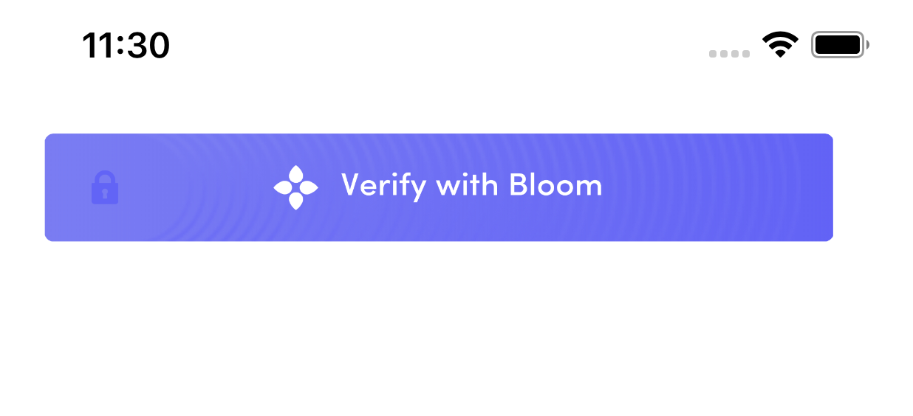

# Share Kit iOS

iOS implementation of [Share Kit](https://github.com/hellobloom/share-kit#readme)

## Building The Framework

1. Open the `sharekit.xcodeproj` in Xcode in Mac OSX.
2. Once the project opens in Xcode, make sure the build scheme selected is `sharekit-universal` , the device can be anything you choose.

3. Clean the build folder by selecting `Product -> Clean Build Folder` in Xcode.
4. Then build the sharekit project by selecting `Product -> Build` in Xcode.
5. When the project is successfully built, finder should popup the `framework` directory, which should now contain the `sharekit.framework` iOS cocoa touch framework


## Installation

1. Create a new Xcode project if you don't have one or alternatively open an existing Xcode project and make sure the `iOS Deployment Target` for your project is `8.0` or greater.


### IMPORTANT!  
2. Because of an embedding issue with Xcode, make sure your Xcode project is one or more directories higher than the `framework` folder, otherwise the embedding step below will fail.
3. Then add the `sharekit.framework` cocoa touch framework , created above , into your project as embedded binary by doing the following

	- Go to your Xcode project targets, select the `General` tab and then scroll down to the `Embedded Binaries` section and click on the '+'' button
	  
	- Then click the `Add Other` button and select the `sharekit.framework` file
	  
	- Navigate to the location of the `sharekit.framework` folder and then click on the `open` button and make sure `Copy items if needed` option is checked in the options screen
	  

	- The framework should be added to your project and ready for usage.


## Usage

To use the share-kit `RequestButton` in your project, please do the following

# Objective C
1. Import the `RequestButton` header file into the respective ViewController i.e. `#import "ShareKit/RequestButton.h"`
2. Then initialize it, set the share-kit request data & callback-url and add it to your view like this
 
 ```    
 - (void)viewDidLoad {
    [super viewDidLoad];
    
    // initialize the button at a particular position in your screen
    CGRect frame = CGRectMake(20, 300, 300, 90);
    RequestButton *bloomButton = [[RequestButton alloc] initWithFrame:frame];
    
    //set the request data
    NSMutableDictionary *requestData =  [NSMutableDictionary dictionary];
    [requestData setObject:action_attestation forKey:@"action"];
    [requestData setObject:@"0x8f31e48a585fd12ba58e70e03292cac712cbae39bc7eb980ec189aa88e24d043" forKey:@"token"];
    [requestData setObject:@"https://receive-kit.bloom.co/api/receive" forKey:@"url"];
    [requestData setObject:@"https://bloom.co/images/notif/bloom-logo.png" forKey:@"org_logo_url"];
    [requestData setObject:@"Bloom" forKey:@"org_name"];
    [requestData setObject:@"https://bloom.co/legal/terms" forKey:@"org_usage_policy_url"];
    [requestData setObject:@"https://bloom.co/legal/privacy" forKey:@"org_privacy_policy_url"];
    // and the attestation types
    NSArray *attestationTypes = @[@"full-name",@"phone",@"email"];
    [requestData setObject:attestationTypes forKey:@"types"];
    
    //and callback url for your app
    NSString *callBackUrl = @"https://google.com";
    
    // then set the request data
    [bloomButton setRequestData:requestData withCallbackUrl:callBackUrl];
    
    //finally add the button to your view
    [self.view addSubview:bloomButton];
}

```
3. Clean and build your project and if the above was done correctly, your app should build and deploy successfully with the `RequestButton` displayed as shown in the example below

4. Finally also please checkout the sample project `sharekittest.xcodeproj` for a sample implementation.

## Deploying your App to the App Store

- In the above step of building the framework using the `sharekit-universal` target/build scheme, the `sharekit.framework` has been built to support both  device `[armv7, armv7s, arm64, arm64e]` and simulator `[x86_64, i386]` architectures to make it easy to deploy and test in both. 
- But because the iTunes app store only supports the device/arm architectures, then that means if you try to ship your app with the above built `sharekit.framework` it will be rejected.
- The fix to this issue is very easy as described [here](https://stackoverflow.com/a/41416964), basically add the following script to the `build phases` option of your Xcode project , as a `Run Script`, before building and uploading your app to the app store.

```
echo "Target architectures: $ARCHS"

APP_PATH="${TARGET_BUILD_DIR}/${WRAPPER_NAME}"

find "$APP_PATH" -name '*.framework' -type d | while read -r FRAMEWORK
do
FRAMEWORK_EXECUTABLE_NAME=$(defaults read "$FRAMEWORK/Info.plist" CFBundleExecutable)
FRAMEWORK_EXECUTABLE_PATH="$FRAMEWORK/$FRAMEWORK_EXECUTABLE_NAME"
echo "Executable is $FRAMEWORK_EXECUTABLE_PATH"
echo $(lipo -info "$FRAMEWORK_EXECUTABLE_PATH")

FRAMEWORK_TMP_PATH="$FRAMEWORK_EXECUTABLE_PATH-tmp"

# remove simulator's archs if location is not simulator's directory
case "${TARGET_BUILD_DIR}" in
*"iphonesimulator")
    echo "No need to remove archs"
    ;;
*)
    if $(lipo "$FRAMEWORK_EXECUTABLE_PATH" -verify_arch "i386") ; then
    lipo -output "$FRAMEWORK_TMP_PATH" -remove "i386" "$FRAMEWORK_EXECUTABLE_PATH"
    echo "i386 architecture removed"
    rm "$FRAMEWORK_EXECUTABLE_PATH"
    mv "$FRAMEWORK_TMP_PATH" "$FRAMEWORK_EXECUTABLE_PATH"
    fi
    if $(lipo "$FRAMEWORK_EXECUTABLE_PATH" -verify_arch "x86_64") ; then
    lipo -output "$FRAMEWORK_TMP_PATH" -remove "x86_64" "$FRAMEWORK_EXECUTABLE_PATH"
    echo "x86_64 architecture removed"
    rm "$FRAMEWORK_EXECUTABLE_PATH"
    mv "$FRAMEWORK_TMP_PATH" "$FRAMEWORK_EXECUTABLE_PATH"
    fi
    ;;
esac

echo "Completed for executable $FRAMEWORK_EXECUTABLE_PATH"
echo $(lipo -info "$FRAMEWORK_EXECUTABLE_PATH")

done
```
- This script will strip the `[x86_64, i386]` architectures from the `sharekit.framework` but beware this means your app will no longer be able to run in the simulators. So please only do this when deploying to the app store and afterwards build and embed the framework again and delete the script from the `build phases` when you want to test in a simulator.


